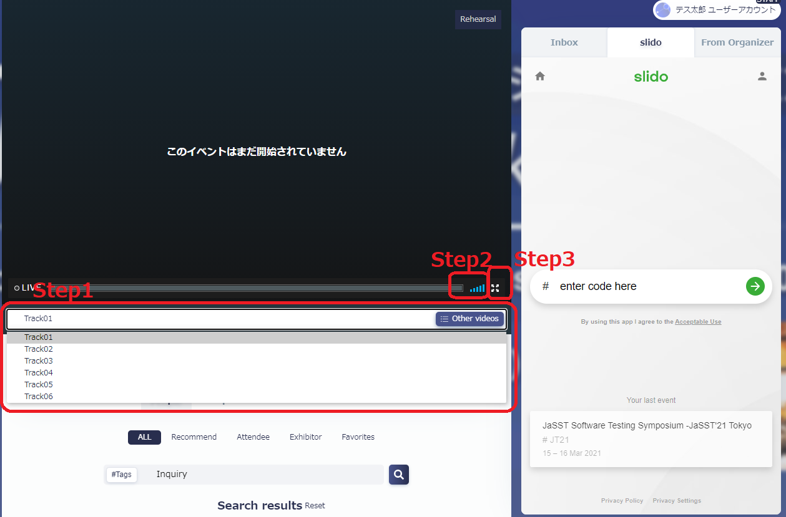
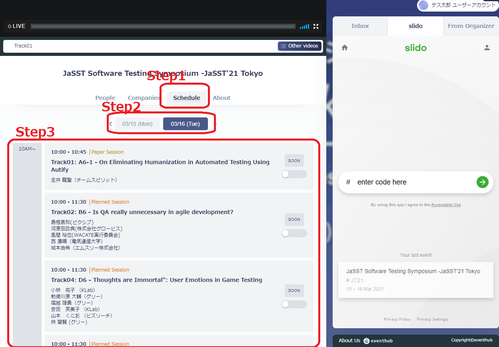
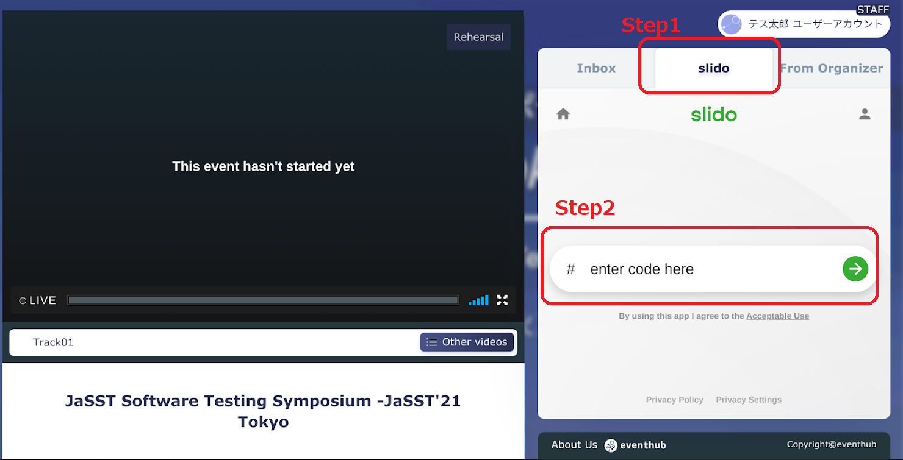
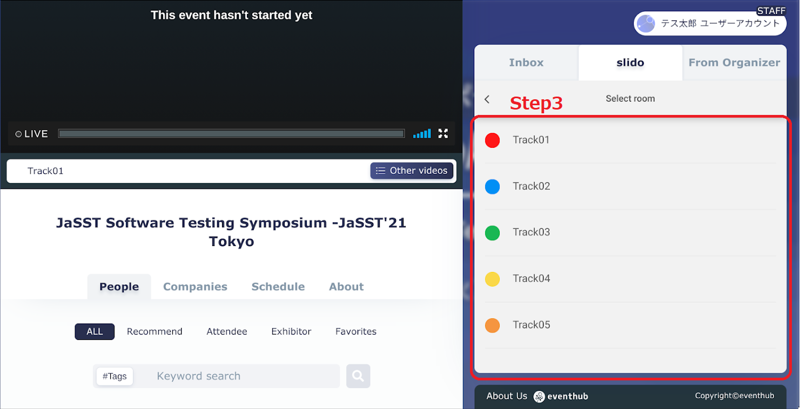
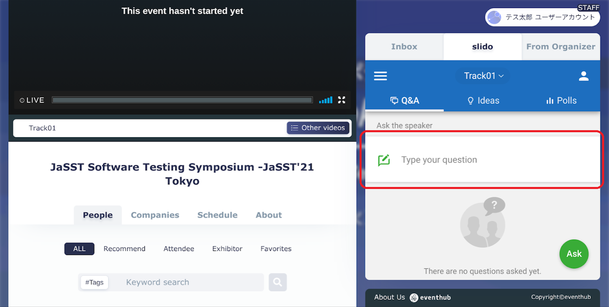
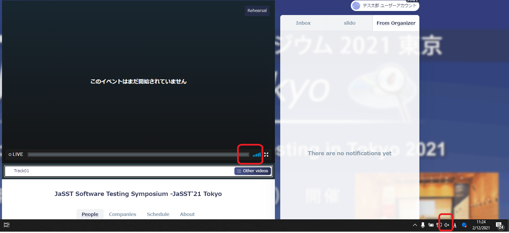
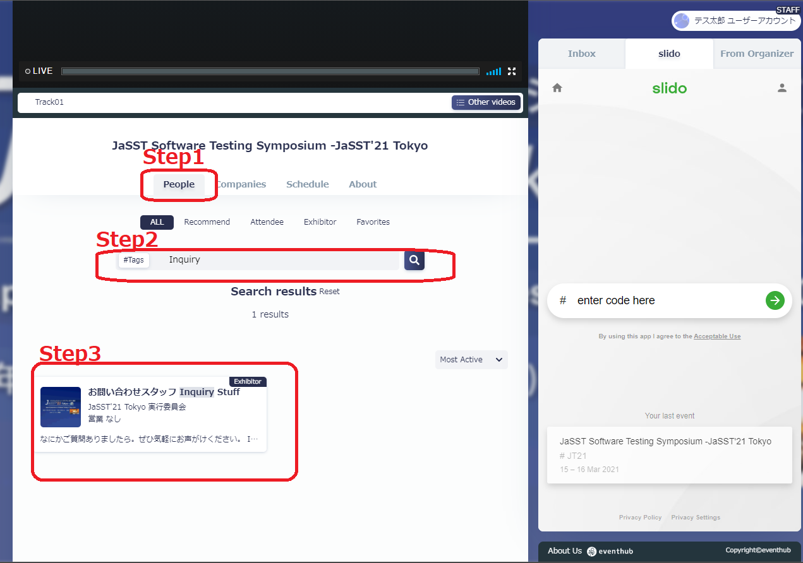
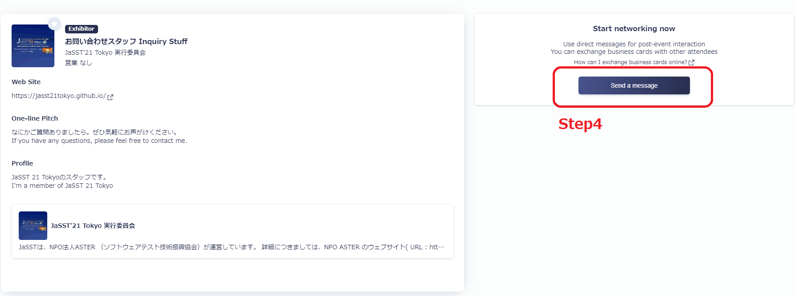

# 目次/Index
- [Q: 視聴の仕方がわかりません/ How can I see the session?](#q-視聴の仕方がわかりません-how-can-i-see-the-session)
- [Q: セッションスケジュールがわかりません / How can I know about the sessions?](#q-セッションスケジュールがわかりません--how-can-i-know-about-the-sessions)
- [Q:各セッションの質問はどのようにすればよいでしょうか？/How can I ask questions for each session?](#q各セッションの質問はどのようにすればよいでしょうかhow-can-i-ask-questions-for-each-session)
- [Q.音が聞こえません、映像が見れません/ I can't hear the sound or see the video.](#q音が聞こえません映像が見れません-i-cant-hear-the-sound-or-see-the-video)
- [Q.ベストスピーカー賞に投票したいです/ I'd like to vote for best speaker.](#q音が聞こえません映像が見れません-i-cant-hear-the-sound-or-see-the-video)
- [Q.参加者アンケートに回答したいです/I would like to answer the participant survey.](#q音が聞こえません映像が見れません-i-cant-hear-the-sound-or-see-the-video)
- [Q:その他、事務局に問い合わせがしたいです。/I have some inquiries to the organizer.](#qその他事務局に問い合わせがしたいですi-have-some-inquiries-to-the-organizer)

## Q: 視聴の仕方がわかりません/ How can I see the session?
## A: 画面中央上部にあるプレイヤーを使ってください / Please use the player at the top center of the screen.
### Step 1 聴講したいトラックをします / Click your track
### Step 2 音量を調節します / Adjust your volume
### Step 3 必要に応じてプレイヤーを最大化します / Maximize the player as needed

## Q: セッションスケジュールがわかりません / How can I know about the sessions?
## A: 中央の"スケジュール"タブをご利用ください/Please use the "Schedule" tab on the center.
### Step 1 "スケジュール"タブをクリックしてください / Click "Schedule" タブ on the center
### Step 2 対象の日付をご選択ください　/ Select the day
### Step 3 スケジュールをご確認ください　/ Check your sessions schedule

## Q:各セッションの質問はどのようにすればよいでしょうか？/How can I ask questions for each session?
## A:右側の"slido"タブをご利用ください/Please use the "slido" tab on the right.
### Step 1 右側の"slido"のタブをクリックしてください/ Click "slido" on the right
### Step 2 検索窓に "JT21" と入力して JaSST 21 Tokyoを検索してください/ Search with keyword "JT21" 

### Step 3 ご参加されている、トラックを選択してください/ Select your track.

### Step 4 枠内に質問を入力ください / Input your question

## Q.音が聞こえません、映像が見れません/ I can't hear the sound or see the video.
## A. プレイヤーの設定を確認ください、それでもだめなら、ージの更新やログアウト、PCの再起動を試してください/Please check the settings of your player, if it still doesn't work, please try to refresh the page, logout, or restart your PC.

## Q:ベストスピーカー賞に投票したいです/ I'd like to vote for best speaker.
## A:https://forms.gle/d2u1uN19WSxJFZHV8 で投票してください/ Plese go to https://forms.gle/d2u1uN19WSxJFZHV8
### EventHubで登録されたメールアドレスで、お一人様１枚のみ投票をお願いします。/ Please vote for one per person using the email address you registered on EventHub.
### なお締切を3/16 15:20までとさせていただきます。/The deadline would be March 16, 15:20 JST
## Q.参加者アンケートに回答したいです/I would like to answer the participant survey.
## A: https://forms.gle/YonhnJzaNkB97m9W7　 で回答してください/ Plese go to  https://forms.gle/YonhnJzaNkB97m9W7
## Q:その他、事務局に問い合わせがしたいです。/I have some inquiries to the organizer.
## A:中央の"探す"タブをご利用ください/Please use the "People" tab on the center.
### Step 1 "探す"タブをクリックしてください / Click "People" タブ on the center
### Step 2 "Inquiry" でご検索ください / Search with keyword "Inquiry"
### Step 3 "お問い合わせスタッフ Inquiry Stuff" をクリックしてください Click "お問い合わせスタッフ Inquiry Stuff"

### Step 4 "Send a message" をクリックしてください / Click "Send a message"

